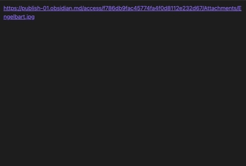

# Paste Image URL as embed

Insert external image URLs as embed using regular `Ctrl/Cmd + V`. Even works with image URLs without file extension.
This achieves the same as typing `` in Markdown.

Also works with the text selection via the command palette/hotkey (needs to be set manually).

## Demo

## Installation

TBD

## Thanks

- [obsidian-url-into-selection](https://github.com/denolehov/obsidian-url-into-selection) This project was very helpful for building this plugin
- [This](https://www.zhenghao.io/posts/verify-image-url) blog article was helpful to not only rely on Regex for recognizing an image url

If this plugin helped you and you would like to support my work you can buy me coffee.

